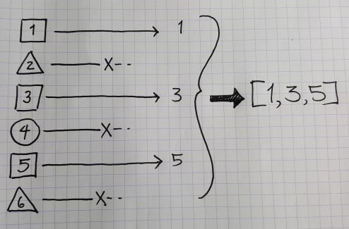
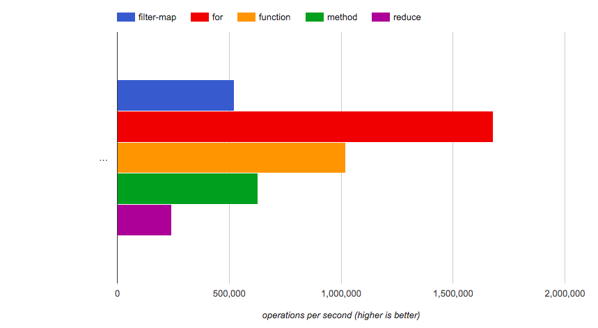

## Intro

Imagine the following, relatively common scenario: I have an array which I need to pick specific items out of and transform into a new format.

I've noticed that this problem comes up especially frequently in React land when there's an array of components that needs to be generated from an array of objects.

### An example

For example, imagine that, given an array of user objects, we need to take only the users that have verified their account, and create a list of their emails:

The user list:

```javascript
const users = [
  { name: 'alex', isVerified: true, email: 'alex@mail.net' },
  { name: 'bobby', isVerified: false, email: 'bobby@mail.net' },
  { name: 'charlie', isVerified: true, email: 'charlie@mail.net' },
  { name: 'dannie', isVerified: false, email: 'dannie@mail.net' },
  { name: 'elliot', isVerified: false, email: 'elliot@mail.net' },
  { name: 'finn', isVerified: true, email: 'finn@mail.net' },
]
```

We want the following array as a result:

```
['alex@mail.net', 'charlie@mail.net', 'finn@mail.net']
```

### A visual example

For those who prefer a visual, imagine that we have objects with a shape and a number value, and we want an array of all the numbers from the squares:



## Three common paths

How would you get to the goal from the examples above?

I've come across three main patterns for dealing with this situation: using a `for` loop, `filter`ing the array and then `map`ping the result, or using a `reduce`r. Let's take a closer look at each of these approaches, using the `users` object from the first example and the goal of having an array of email addresses as the result. Note that in the code I'm going to try my best to make the code _intelligible_, so I'll skip destructuring parameters and nitpicking every character. This isn't code golf, after all :wink:!

### For loop

#### Code

```javascript
const users = [
  { name: 'alex', isVerified: true, email: 'alex@mail.net' },
  { name: 'bobby', isVerified: false, email: 'bobby@mail.net' },
  { name: 'charlie', isVerified: true, email: 'charlie@mail.net' },
  { name: 'dannie', isVerified: false, email: 'dannie@mail.net' },
  { name: 'elliot', isVerified: false, email: 'elliot@mail.net' },
  { name: 'finn', isVerified: true, email: 'finn@mail.net' },
]

// initialize array
const userEmails = []
// loop through each item, pushing their email to the list if the user isVerified
for (let i = 0; i < users.length; i++) {
  if (users[i].isVerified) {
    userEmails.push(users[i].email)
  }
}

console.log(userEmails)
// [ 'alex@mail.net', 'charlie@mail.net', 'finn@mail.net' ]
```

Ah, the `for` loop: one of the corner stones of most programming languages. Simple and versatile! There's not too much to explain here, and if you've done some programming in any language you should be able to see what's going on here. We're initiating a new array and pushing elements into it.

#### Pros

- By far the fastest option to compute (see the section below about performance).
- Relatively readable (I'd give it a score of 3/5: if you read the code you'll see what's going on because we're not doing anything fancy).

#### Cons

- Verbose (minified length of 96 characters)
- Easy to mess up: even though the code itself is simple, there are more moving parts here. You could easily make a mistake such as writing `for (let i = 0; i <= users.length; i++)` and not necessarily realize it.
- It's not hip. I mean we've had ES6 array methods, for, like, ever! Why would we ever mutate the value of any variable? (While true, this is meant to be sarcastic.)

### filter + map

```javascript
const users = [
  { name: 'alex', isVerified: true, email: 'alex@mail.net' },
  { name: 'bobby', isVerified: false, email: 'bobby@mail.net' },
  { name: 'charlie', isVerified: true, email: 'charlie@mail.net' },
  { name: 'dannie', isVerified: false, email: 'dannie@mail.net' },
  { name: 'elliot', isVerified: false, email: 'elliot@mail.net' },
  { name: 'finn', isVerified: true, email: 'finn@mail.net' },
]

const userEmails = users
  .filter(user => user.isVerified) // keep if user.isVerified is truthy
  .map(user => user.email) // for each filtered user, return the email

console.log(userEmails)
// [ 'alex@mail.net', 'charlie@mail.net', 'finn@mail.net' ]
```

I'm not going to hide anything here. This is the winner in my mind (with the exception of if you're really looking to improve your the performance of your app by shaving off microseconds.

#### Pros

- The second fastest option to compute (see the section below about performance).
- _Very_ readable (I'd give it a score of 5/5: just at a glance, we know that we are `filter`ing (removing) items from an array, and then `map`ping (transforming) the remaining items. We know that we'll get an array back after the operations are performed.).
- The least verbose (minified length of 63 characters)
- Hard to mess up. For the same reason that makes this code easy to read, this code is hard to mess up. Performing small, chained operations for the win!

#### Cons

- I'll wait for someone to correct me, but I'm going with "none" unless you're supporting IE10 or something.

### reduce

```javascript
const users = [
  { name: 'alex', isVerified: true, email: 'alex@mail.net' },
  { name: 'bobby', isVerified: false, email: 'bobby@mail.net' },
  { name: 'charlie', isVerified: true, email: 'charlie@mail.net' },
  { name: 'dannie', isVerified: false, email: 'dannie@mail.net' },
  { name: 'elliot', isVerified: false, email: 'elliot@mail.net' },
  { name: 'finn', isVerified: true, email: 'finn@mail.net' },
]

const userEmails = users.reduce((accumulator, user) => {
  if (user.isVerified) {
    return [...accumulator, user.email] // return the previous array plus the new user email
  }
  return accumulator // otherwise return the array without changes
}, []) // initialize accumulator as an empty array

console.log(userEmails)
// [ 'alex@mail.net', 'charlie@mail.net', 'finn@mail.net' ]
```

If your intuition was to reach for a reducer, you're too cool for me. While `reduce` is versatile I find it unintuitive, unfriendly to junior developers and code reviewers, and generally not the best tool for this operation.

#### Pros

- The second least verbose (minified length of 71 characters)
- Super hip. I don't know why, but when you use a `reducer` you've suddenly reached a new leve of hipness.

#### Cons

- The slowest of the three options, computationally (see the section below about performance).
- Not very readable (I'd give it a score of 2/5: every time I run into a reduce, it's like the for loops: I need to read every line to wrap my head around the operation; and the return value isn't necessarily an array (you can use a reducer to get a string or a boolean or whatever you want: it's flexibility makes it harder to understand at a glance). Additionally, I just don't like that the initial value of a reduce comes after the reducer function. I find that generally unintuitive.).

## Performance

This article actually comes from a code review and the ensuing debate that I had engaged in at work where someone had written some technically incorrect code (they had used just a `map`, and had not `filter`ed out the unwanted items). In general, we tend to use reduce for everything, and I was arguing for `.filter().map()`. I ended up writing [a JSPerf test](https://jsperf.com/filtermap-vs-reduce-vs-for-vs-function-vs-method) outlining the speed difference between the operations discussed here and a few others. I was surprised by the results: `.filter().map()` performed twice as well as `.reduce` and `for` performed three times as well as `.filter().map()`!



I was surprised by the results, especially, as one of my colleagues pointed out, "We're looping over the data twice with the filter-map, and only once with the reducer." Results may vary by how you write your functions, and the reduce end up being faster than the filter-map, but noy bu much. As for the `for` loop, I wasn't surprised that it was the winner, but I didn't expect it to win by so much. It turns out that invoking the reduce function repeatedly is pretty time consuming, as briefly described in [this article](https://hackernoon.com/3-javascript-performance-mistakes-you-should-stop-doing-ebf84b9de951?gi=fc581d91f3a0), but some of the details are over my head. If someone can explain why this is the case, I'd love to hear about it.

## Verdict

As interesting as the performance results are, we are talking about saving microseconds in the end, and, while it might make sense in some situations to insist on those savings, I don't think that the time savings warrant more obtuse code. For that reason, I'd suggest going with the friendly, self-documenting, hard to screw up `.filter().map()` for this specific operation.

For the record, I think that reduce probably still has its place, but it's not to replace `.filter().map()`. I'd actually be hard-pressed to say that it should replace any given `for` loop since it's just about as descriptive as the for loop, and slower. For me, `reduce` shines when you can create reusable reducer functions that you need throughout your application, and you just need to drop in `myArray.reduce(myReducer, [])`. I'd love if someone could point out why we should use reduce more often!

## Join the discussion!

Head over to the [dev.to article](https://dev.to/cmborchert/the-great-iterate-debate-filter-map-reduce-or-for-1bjk) and leave a comment. I love me some feedback!

---

_Cover Image Credits:_
Photo by [Javier Allegue Barros](https://unsplash.com/photos/C7B-ExXpOIE?utm_source=unsplash&utm_medium=referral&utm_content=creditCopyText) on [Unsplash](https://unsplash.com/search/photos/choice?utm_source=unsplash&utm_medium=referral&utm_content=creditCopyText)
